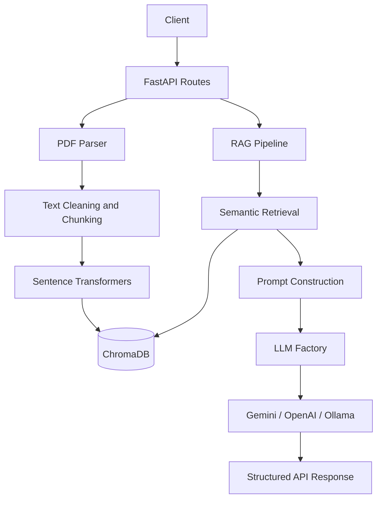

# Smart CV Matcher — Technical Report & README

**Version:** 1.0.0 | **Team Role:** Backend + DevOps Engineer

---

## Executive Summary

Smart CV Matcher is an end-to-end Retrieval-Augmented Generation (RAG) system that ingests raw CV PDFs (English and Arabic) and answers natural-language questions about candidates — e.g., _"Is this candidate suitable for a Data Analyst role?"_ — using retrieved CV context injected into an LLM.

The system is fully containerized via Docker and exposes a clean REST API built with FastAPI following MVC architecture principles.

---

The application follows a modular service architecture that separates API routes, configuration, document processing, retrieval, and LLM integration.

### Request flow



### Core components

- **FastAPI routes:** Handle CV uploads, CV listing, health checks, and query requests.
- **PDF parser:** Extracts PDF text, detects language, cleans text, and creates overlapping chunks.
- **Vector store:** Generates embeddings and stores or retrieves CV chunks in ChromaDB.
- **RAG pipeline:** Retrieves relevant excerpts, builds the LLM prompt, and assembles the response.
- **LLM factory:** Selects the configured Gemini, OpenAI, or Ollama implementation.
- **Configuration:** Reads model, provider, chunking, retrieval, and storage settings from environment variables.

The architecture separates these responsibilities into modules, making individual components easier to inspect, test, and maintain.

---

## API Documentation

### Base URL: `http://localhost:8001` (Docker Compose)
| Method | Endpoint | Description | Request Body |
|--------|----------|-------------|--------------|
| GET | `/health` | System status check | — |
| POST | `/cv/upload` | Upload a CV PDF | `multipart/form-data` file |
| GET | `/cv/list` | List all uploaded CVs | — |
| DELETE | `/cv/{filename}` | Remove a CV | — |
| POST | `/query/ask` | Ask a question (RAG) | JSON (see below) |

### `POST /query/ask` — Request Body

Submit a natural-language question about the stored CVs.

```json
{
  "question": "What programming languages does this candidate know?",
  "cv_filename": "john_doe.pdf",
  "top_k": 5,
  "llm_provider": "ollama"
}
```

**Request fields**

| Field | Type | Required | Description |
|---|---|---|---|
| `question` | string | Yes | Question about the stored CVs, in English or Arabic |
| `cv_filename` | string | No | Restricts retrieval to a specific CV filename |
| `top_k` | integer (1–20) | No | Number of chunks to retrieve; defaults to the server setting |
| `llm_provider` | string | No | Provider override: `gemini`, `openai`, or `ollama` |

### `POST /query/ask` — Response

The endpoint returns a structured response similar to the following. Actual values depend on the documents, query, and configured LLM.

```json
{
  "question": "What programming languages does this candidate know?",
  "answer": "The retrieved CV excerpts mention Python and C#.",
  "llm_provider": "ollama",
  "retrieved_chunks": [
    {
      "text": "Technical skills: Python, C#, SQL.",
      "source": "john_doe.pdf",
      "chunk_id": "",
      "score": 0.82
    }
  ],
  "total_chunks_searched": 12
}
```

The response example is illustrative, not a guarantee of a particular answer or score. `total_chunks_searched` reports the total number of chunks in the collection, not the number of chunks returned by the query.

### `POST /cv/upload` — Upload a CV

Upload a PDF CV using `multipart/form-data`. The form field name is `file`.

**Successful response example**

```json
{
  "filename": "john_doe.pdf",
  "chunks_added": 4,
  "language_detected": "en",
  "message": "Successfully processed 'john_doe.pdf' into 4 chunks."
}
```

The number of chunks depends on the extracted text and configured chunking settings. If no text can be extracted, the endpoint returns HTTP `422`. Non-PDF filenames are rejected with HTTP `400`.

### `GET /cv/list` — List stored CVs

Returns the PDF filenames currently saved on disk and the total number of chunks in the ChromaDB collection.

**Response example**

```json
{
  "cvs": ["john_doe.pdf"],
  "total_chunks_in_db": 4
}
```

### `DELETE /cv/{filename}` — Delete a CV

Deletes the chunks associated with the specified filename from ChromaDB and removes the corresponding saved file if it exists.

**Response example**

```json
{
  "message": "'john_doe.pdf' has been deleted.",
  "remaining_chunks": 0
}
```

**Note:** The current implementation does not verify that a file existed before returning the deletion message. These examples illustrate the response shape; actual values depend on the stored data.

---
## Embedding Model and Semantic Retrieval

The application uses `sentence-transformers/paraphrase-multilingual-MiniLM-L12-v2` to generate vector embeddings for CV chunks and search queries. The model is configurable through the `EMBEDDING_MODEL` environment variable.

### Retrieval pipeline

1. Extract and clean text from uploaded PDF CVs.
2. Split the extracted text into overlapping, page-level chunks.
3. Generate embeddings for the chunks using Sentence Transformers.
4. Store chunk text, embeddings, and metadata in a persistent ChromaDB collection.
5. Embed each search query and retrieve the most similar chunks using cosine distance.
6. Return the retrieved text and metadata to the downstream query pipeline.

### Configuration

| Setting | Default | Purpose |
|---|---|---|
| `EMBEDDING_MODEL` | `sentence-transformers/paraphrase-multilingual-MiniLM-L12-v2` | Embedding model |
| `CHROMA_PERSIST_DIR` | `./chroma_db` | Persistent vector-store directory |
| `CHROMA_COLLECTION` | `cv_chunks` | ChromaDB collection name |
| `TOP_K` | `5` | Default retrieval count, subject to endpoint configuration |

The vector-store service initializes the embedding model and ChromaDB collection lazily and reuses them through module-level variables.

**Important:** Retrieved similarity scores are calculated as `1 - cosine distance`. They are ranking signals, not probabilities. Retrieval quality should be evaluated on representative Arabic and English CVs and job descriptions.

---

## Chunking Strategy

The PDF parser uses a whitespace-based sliding-window strategy to split extracted text into smaller chunks for embedding and retrieval.

| Parameter | Default | Description |
|-----------|---------|-------------|
| Chunk size | 400 words | Maximum number of whitespace-separated tokens per chunk |
| Overlap | 50 words | Shared words between consecutive chunks to preserve context |
| Processing | Page by page | Each PDF page is cleaned and chunked independently |

**Why this approach?** The lightweight strategy requires no separate tokenizer in the PDF parsing service and supports both Arabic and English text. However, whitespace-separated words are not equivalent to model tokens, and chunk boundaries do not cross PDF pages.


---

## Arabic Text Processing

The PDF parser includes basic preprocessing for English and Arabic CVs.

1. **Language detection:** Checks the extracted text for Arabic Unicode characters first. If none are detected, it uses `langdetect` on a sample of up to 500 characters.
2. **Text cleaning:** Collapses whitespace and removes characters outside a defined set of letters, digits, and basic punctuation.
3. **Arabic normalization:** Removes common Arabic diacritics, maps `إ`, `أ`, `آ`, and `ٱ` to `ا`, maps `ى` to `ي`, and maps `ة` to `ه`.
4. **PDF extraction:** Uses `pdfplumber` to extract text from each page before cleaning and chunking.
5. **Embeddings:** Uses a multilingual Sentence Transformers model intended to support retrieval across languages, including Arabic and English.

**Limitations:** Text extraction quality depends on the PDF layout and whether the document contains selectable text. Scanned PDFs may require OCR. Arabic normalization can also change distinctions between words, so its effect on retrieval quality should be evaluated on representative documents.

---

## LLM Provider Integration

The application uses a factory pattern to provide a common interface for three LLM backends. The selected provider can be configured globally or overridden per query when supported by the API.

| Provider | Model | Configuration |
|----------|-------|---------------|
| Gemini | `gemini-1.5-flash-latest` | `GEMINI_API_KEY` |
| OpenAI | `gpt-4o-mini` | `OPENAI_API_KEY` |
| Ollama | Value of `OLLAMA_MODEL` | Local Ollama service |

### How it works

The `get_llm()` factory selects the provider implementation. Each implementation sends requests through HTTP using `httpx`, without requiring a separate provider SDK.

- **Cloud providers:** Require a valid API key and network access.
- **Ollama:** Requires a running Ollama service and the configured model to be available locally. Download the model before querying it.
- **Provider selection:** Set `LLM_PROVIDER` in `.env` to choose the default provider. The query endpoint may also support a per-request override.

Provider availability, model identifiers, API limits, and costs depend on the respective provider's current configuration and policies.

---

## Docker Deployment Instructions

### Prerequisites

- Docker Desktop installed and running.
- An API key for your chosen cloud LLM provider, if applicable.
- Ollama for local LLM inference (included in the Docker Compose configuration).

### Setup

1. Clone the repository and navigate to the project directory.
2. Create your local environment file:

   ```bash
   cp .env.example .env
   ```

   On Windows PowerShell, use:

   ```powershell
   Copy-Item .env.example .env
   ```

3. Edit `.env` to configure your LLM provider and any required API keys. Never commit `.env` or expose API keys in your repository.
4. Build and start the services:

   ```bash
   docker compose up --build
   ```

5. Open the interactive API documentation:

   **http://localhost:8001/docs**

### Useful endpoints

- API documentation: `http://localhost:8001/docs`
- Health check: `http://localhost:8001/health`
- Root endpoint: `http://localhost:8001/`

Docker Compose maps host port `8001` to container port `8000`. If you run Uvicorn directly on your computer using port `8000`, use `http://localhost:8000` instead.

---

## Testing

The project includes automated tests built with `pytest` and FastAPI's `TestClient`.

### Run the tests

From the project root, activate your virtual environment and install the development dependencies:

```powershell
python -m pip install -r requirements-dev.txt
```

Then run:

```powershell
python -m pytest -v
```

To run a specific test file:

```powershell
python -m pytest tests/test_health.py -v
python -m pytest tests/test_api.py -v
```

The tests verify API endpoint behavior. A successful Python syntax check alone does not guarantee that the tests pass; the application dependencies must be installed and the tests must execute successfully.

---

## Project Structure

```
```text
smart-cv-matcher/
├── app/
│   ├── api/
│   │   ├── cv_routes.py
│   │   ├── health.py
│   │   └── query_routes.py
│   ├── core/
│   │   ├── __init__.py
│   │   └── config.py
│   ├── models/
│   │   ├── __init__.py
│   │   └── schemas.py
│   ├── services/
│   │   ├── llm_factory.py
│   │   ├── pdf_parser.py
│   │   ├── rag_pipeline.py
│   │   └── vector_store.py
│   ├── __init__.py
│   └── main.py
├── tests/
│   ├── test_api.py
│   └── test_health.py
├── .env.example
├── .gitignore
├── Dockerfile
├── docker-compose.yml
├── requirements.txt
├── requirements-dev.txt
└── README.md
```